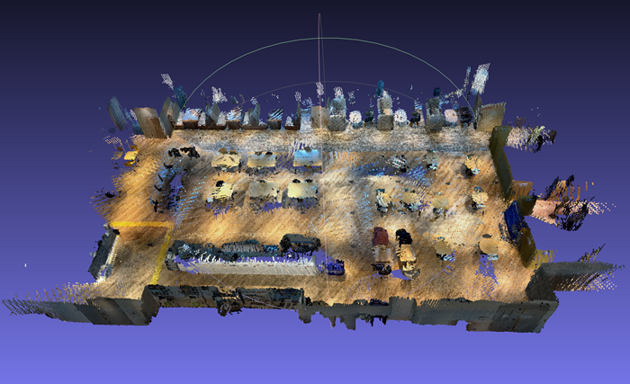
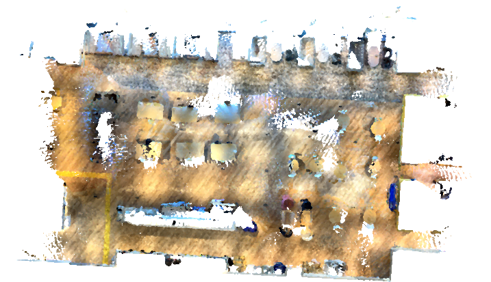
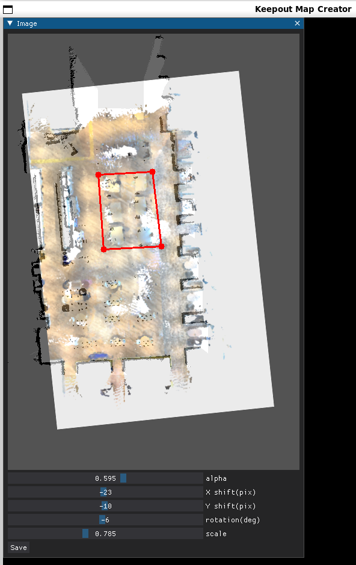

# nav2-keepout-zone-map-creator

## Introduction

[Nav2](https://navigation.ros.org/) provides [Keepout Filter](https://navigation.ros.org/tutorials/docs/navigation2_with_keepout_filter.html). But, it is difficult to create **Keepout Zone** map using only Occupancy Grid Map. `nav2-keepout-zone-map-creator` is a tool that allows you to create a keepout zone map from an Occupancy Grid Map and 3D point cloud.

## Demo


## Requirements

- Python 3.10
- Open3D
- NumPy
- OpenCV
- Dear PyGui

## Preparation

### Installing the Package

```shell
python3 -m venv .venv/nav2-keepout-zone-map-creator
source .venv/nav2-keepout-zone-map-creator/bin/activate
pip install -r requirements.txt
```

### Generating Occupancy Grid Map

You will need to generate a Occupancy Grid Map. As an example, we have prepared [data/map.pgm](data/map.pgm). This data was generated using [SLAM Toolbox](https://github.com/SteveMacenski/slam_toolbox).

### Generating 3D Point Cloud Map

You will need to generate a 3D point cloud map.

```shell
docker run -it --rm -v $HOME:$HOME introlab3it/rtabmap:22.04 bash
```

```shell
rtabmap-export rtabmap-export <RTABMAP database file>
```

As an example, we have prepared [data/cloud.ply](data/cloud.ply). This data was generated using [RTAB-Map](https://apps.apple.com/td/app/rtab-map-3d-lidar-scanner/id1564774365).

### Generating BEV(Bird's Eye View) image

You will need to generate a **BEV(Bird's Eye View)** image.

```shell
python3 generate_bev_image.py --input=<PointCloud Map PATH>
```

As an example, we have prepared [data/cloud.ply](data/cloud.ply).

```shell
python3 generate_bev_image.py --input=data/cloud.ply
```

|Input Point Cloud|Generated BEV image|
|:---:|:---:|
|||

And, `generate_bev_image.py` has the following option.

|Option|Description|Unit|Required|
|:---|:---|:---:|:---|
|`--input <filepath>`|path to PoindCloud Map|-|True|
|`--min_z <value>`|min_z|meter|False|
|`--max_z <value>`|max_z|meter|False|
|`--vis`|enable to visualize BEV image|-|False|

## Usage

```shell
python3 generate_keepout_zone_map.py --map=<MAP IMAGE>  --bev=<BEV IMAGE>
```

`generate_keepout_zone_map.py` has the following option.

|Option|Description|Unit|Required|
|:---|:---|:---:|:---|
|`--map <MAP IMAGE>`|path to Occupancy Grid Map|-|True|
|`--bev <BEV IMAGE>`|path to BEV image|-|True|

As an example, we have prepared [data/map.pgm](data/map.pgm) and [data/cloud_birdseye.png](data/cloud_birdseye.png).

```shell
python3 generate_keepout_zone_map.py --map=data/map.pgm  --bev=data/cloud_birdseye.png
```



### Adjust parameters

You can adjust the following parameters.

|Parameter|Unit|
|:---|:---:|
|alpha|-|
|X shift|pixel|
|Y shift|pixel|
|rotation|deg|
|scale|-|

### Specify keepout zone

You can specify keepout zone as polygon.

|Operation|Description|
|:---|:---|
|Light Mouse Click|add vertices|
|Push `f` key|finish to add vertices|

### Save keepout zone map

Please push `Save` button. `<MAP_IMAGE_PREFIX>_keepout.pgm` is saved.

### Exit application

Please push `q` key.

## Reference

- <https://navigation.ros.org/tutorials/docs/navigation2_with_keepout_filter.html>
